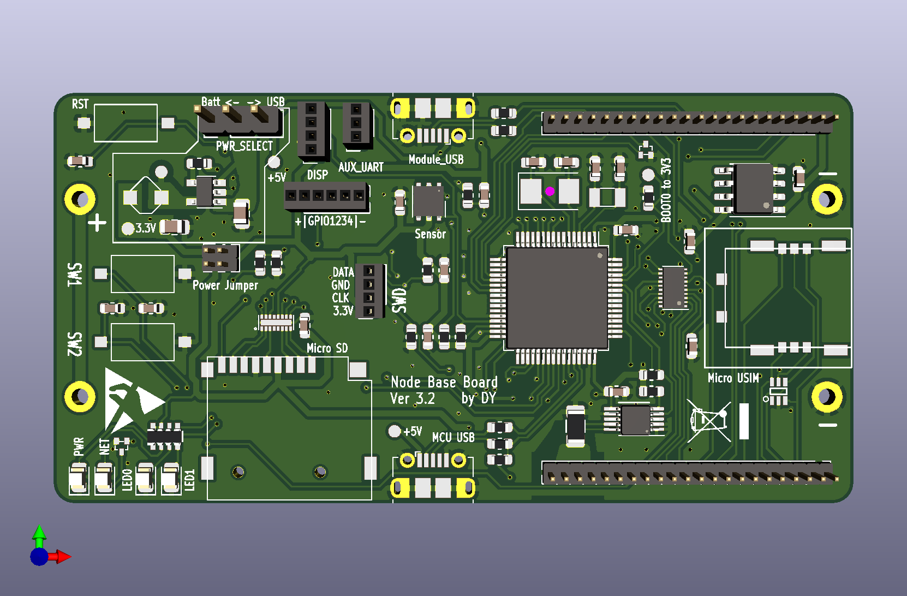
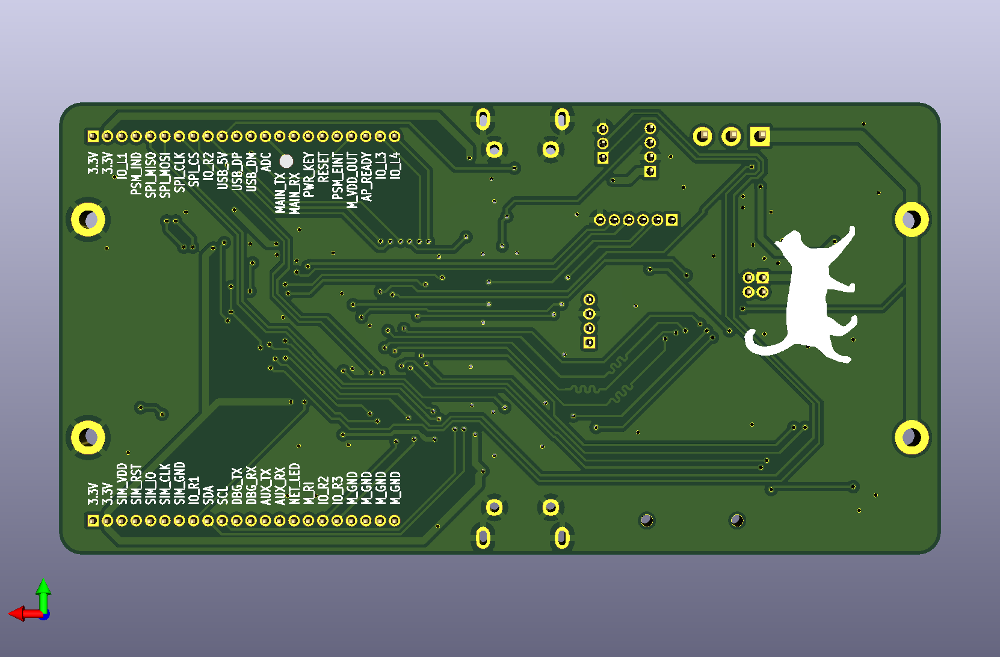
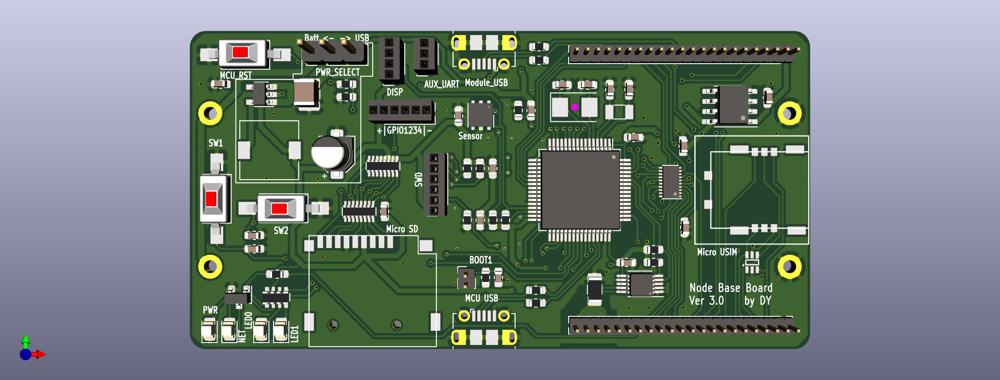
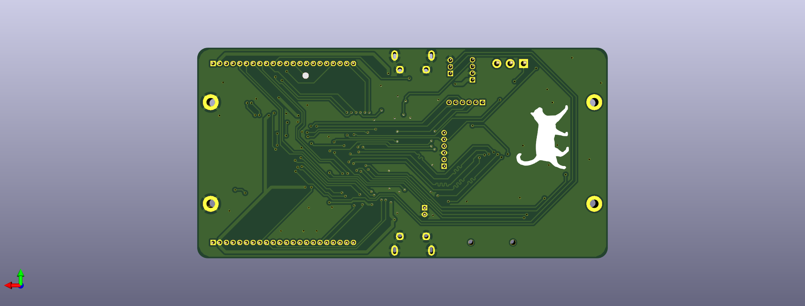

# Introduction

Node mainboard is responsible for hosting the module shieldboard, sensing the environment, collecting debug log and current traces, and so on.

Major components on the board: 

- STM32F103 as the main processor
- LM3671-3.3 as input but converter
- CM1624 as micro SD card protector
- CAT24C128 as non-volatile memory
- TXB0108 as logic level converter (3.3v <-> 1.8v)
- Si7021 as temperature and relative humidity sensor
- INA219 as current sensor

It is powered by one or two 18650 batteries. It also supports USB 5V as the input voltage, using jumper cap to switch.

# Known Issues

If you use the generic ST-Link V2 dongle as programmer, do not use it to power the board alone, otherwise the LM3671 buck converter chip will burn. 

**Correct way**: Power on the board using 18650 battery or 5V USB, then plug on the ST-Link debugger. After you finish programming/debugging, unplug ST-Link V2 FIRST, and then shutdown the board power.

# Suggestions in Mainboard Hardware Design

The latest version (ver 3.2) of mainboard generally works well, but I have several important suggestions for future design. 

1. Upgrade the power chip. LM3671 supports a maximum current of 600 mA, which sometimes has little margin for some NB-IoT modules. So I suggest using other power IC, such as LM3281 or TPS62160.
2. The STM32F103 does not have DMA channel for SD card writing, which means you cannot do anything else when writing the SD card. My suggestion is using another STM32 chip. You need to double check in STM32 CubeMX whether the chip supports DMA channel in SDIO interface.

# NB-IoT UE Pin Assignment

The pin assignment should be taken care for future module shieldboard design.

Note: the labels starting with `M_` means the pins are treated as part of the module. For example, `M_MAIN_UART_TX` means the UART Tx of the module, which should be connected to the MCU UART Rx pin accordingly.

`Left_Conn` means the upper row in the picture below, `Right_conn` is the bottom row accordingly.

The module ground GNDs are aggregated to 4 pins on the `Right_conn`, which passes through a current sampling resistor on the mainboard.

# Gallery

## Ver 3.2

## Ver 3.0

# Change log

## Ver 3.2

- Add a DTC143Z to control the PWRKEY pin for uBlox SARA-R410M-02B and Quectel BG96, BC26, and BC66, such that we don't need the `pwr_key_add_on` modification board for these modules.
- Replace the labels in schematic by another type (with an enclosure), which shows the direction of the signal.

## Ver 3.1

Update the power module. Replace the large inductor to a smaller one. The power module layout is also improved.

## Ver 3.0

Actually the first version of NB-Scope mainboard.
